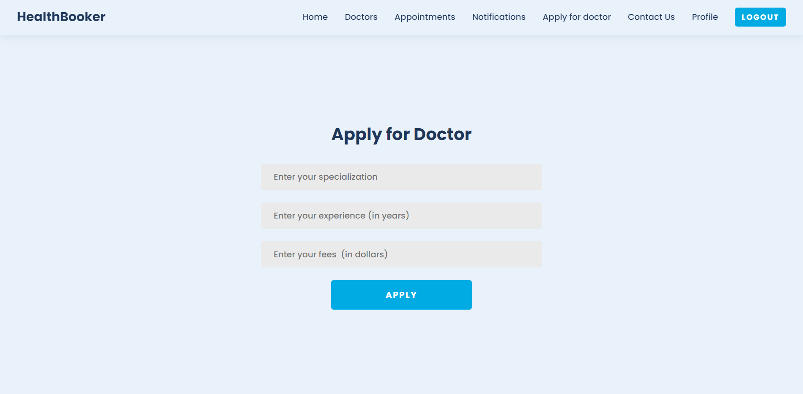
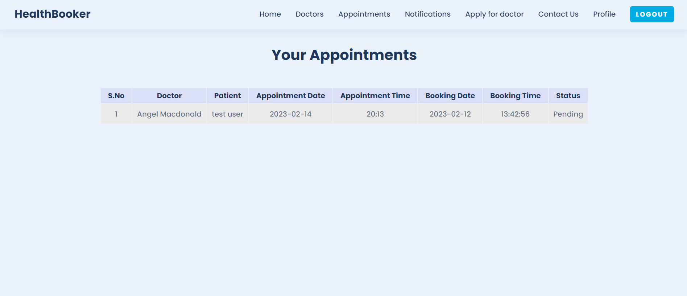

<h1 align="center">HealthBooker 🧑‍⚕️</h1>

### Home page

### Sign up page

### Sign in page

### Profile page

### All Doctors page

### Apply for doctor page

### Admin all users dashboard

### Admin all applications page

### Book Appointment page

### Users all appointments page

### Doctors all appointments page

### Notifications page

---

 

### 🛡️ License

Terms and conditions for use, reproduction and distribution are under the [MIT License](https://opensource.org/license/mit/).

 

---

<h3 align="center"> Give it a 🌟 if you 🧡 this repository </h3>

---

<a href="#top">Back to Top</a>

